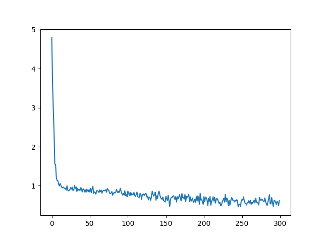

# my-nn-framework

My implementation of Neural Network for better understanding

* almost same usage with tensorflow

* sadly, sigmoid only as activation function

* sadly, sgd only as opt

* sadly, pay no attention to parameter init

## Setup
1. create & activate virtualenv

2. install lib by
    ```
    pip3 install -r requirements.txt
    ```

## Usage

### Example

```python
from my_nn_framework import Model, Dense


model = Model(
    Dense("sigmoid", in_features=64, out_features=30),
    Dense("sigmoid", out_features=10),
)

model.compile(optimizer="sgd", loss="mse")

model.fit(
    x_train,
    y_train,
    epochs=300,
    batch_size=32,
    learning_rate=0.01
)

predicted = model.predict(x_test)

accuracy = Model.evaluate(predicted, y_test)

>>> model.summary()
<bound method Model.summary of Model with 2 layers
    ([Dense: input_features=64, out_features=30],
    [Dense: input_features=30, out_features=10])
>

```

After `Model.fit()`, loss graph like



would be saved as *out.png*

## Acknowledgements
* [Neural Networks and Deep Learning](http://neuralnetworksanddeeplearning.com/)